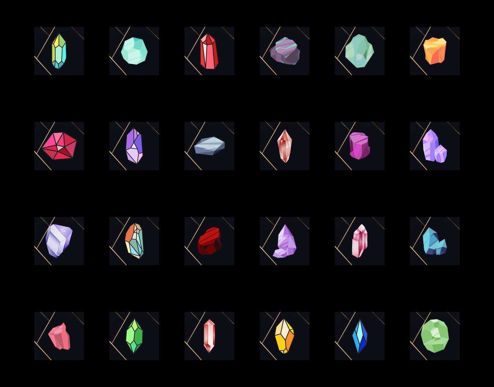
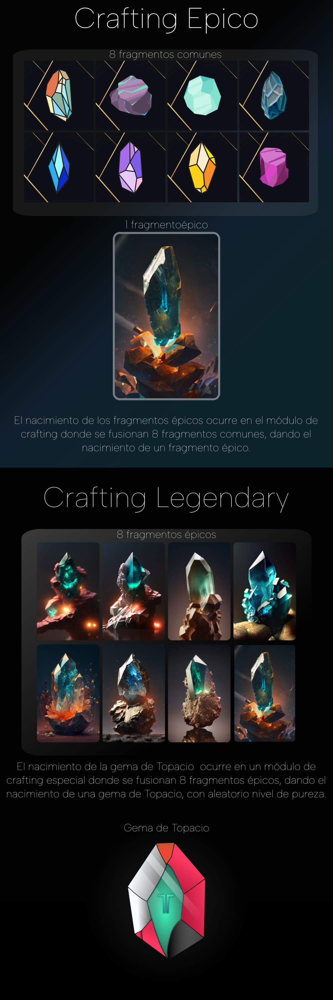
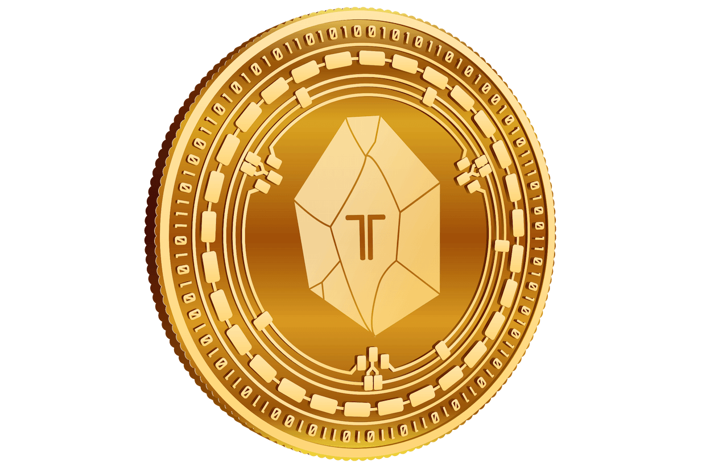
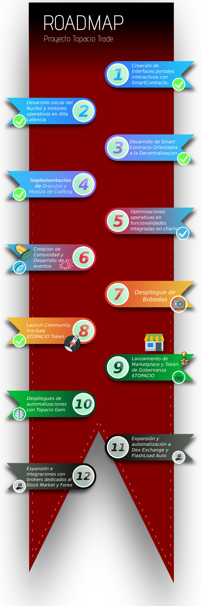

# The Future of Trading Automation
Once seen as an outlandish idea, a few pioneers persevered and saw beyond what the rest of the world could imagine.

Do you remember that first transaction of a couple of pizzas for ten thousand BITCOINS? Well, imagine being part of a project in its infancy, a project that promises to bring total automation to the trading world and combine the web3 world in a unique and disruptive way. This project is TopacioTrade.

At TopacioTrade, we are focused on creating a decentralized platform that allows traders to have absolute control over their investments. Our vision is to revolutionize the financial world, and we are confident we will achieve it. With TopacioTrade, you won't have to worry about intermediaries or third parties controlling your investments—you'll really have total control.

Can you imagine being part of something great, something in its infancy? At TopacioTrade, we are looking for passionate people to join our team and help us create something amazing. If you are passionate about technology and innovation, then this is the project for you. Share, spread the word, and actively participate.

We invite you to learn more about TopacioTrade, to be part of our community, and to help us revolutionize the financial world. Together, we can achieve great things and create a better future for everyone. Join us at TopacioTrade and be part of the crypto and decentralized revolution!

# Why TopacioTrade?
Imagine having the opportunity to be part of a newborn project taking trading to a completely new level. TopacioTrade is a decentralized project centered around total automation of trading and, best of all, it merges the entire web3 world into a disruptive and unique platform.

What does this mean for you? 
First, it means you are at the beginning of something big. You are at the starting point of a platform designed to change the game in the world of cryptocurrencies and trading.

Second, it means you have the opportunity to have absolute control over your assets. With TopacioTrade, you will always have full control over your investments and transactions. No one else will have access to your funds or personal information, which means you can operate with total confidence and security.

Lastly, but no less important, TopacioTrade is an opportunity to be part of a growing community. With the rising popularity of cryptocurrencies and decentralized trading, you are in the right place at the right time. You can connect with other traders and enthusiasts from around the world and be part of a movement that is revolutionizing the way trading is done.

So, are you ready to join us on this exciting journey? Don't miss the chance to be part of something great! Learn more about TopacioTrade and discover how you can be part of this revolution in the trading world. We are waiting for you!

# Topacio Trade: A Powerful Tool for Traders
The Topacio Trade project is a tool designed to support traders, investors, and people interested in the world of cryptocurrencies in making informed decisions in various market volatility scenarios.

How can we identify the best price to open a position in the cryptocurrency market? How can we avoid falling into price manipulation traps set by those who move the market? These are some of the questions we asked ourselves before starting the development of Topacio Trade.

Our team of experts has carried out several studies, analyses, and tests to gather coherent information that has been applied to an effective analysis in various market scenarios, resulting in the creation of Topacio Trade.

This tool is designed to operate in extreme market conditions, analyzing and selecting the best times to buy and sell cryptocurrencies in the spot and futures markets, thus avoiding market ranges. With an efficiency of 90% in different operational timeframes, Topacio Trade performs automated buying and selling based on the user's set configuration, according to their trading plans and investment preferences.

However, Topacio Trade is not just a powerful and effective tool; it also offers an interactive user experience and has its own governance token called "TOPACIO" and a rewards token named "TMINE". Users can also access an ecosystem that integrates the entire Web3 world and features a unique NFT that provides utility for using the automated system. These NFTs can be bought and sold in an independent marketplace module, or they can be staked to receive the TMINE token as a reward, empowering users and providing real-world functionality.

# Unique Features of the Topacio Project
The features of Topacio Trade are unique and disruptive, offering a fully functional tool that runs on the Polygon blockchain. This Layer 2 network enables decentralized applications to operate on a fast, interoperable network with lower fees compared to Ethereum. Users can access the Topacio Trading ecosystem using their Polygon mainnet wallet address, which is also used to store the NFT fragments necessary to assemble a complete TOPACIO NFT.

By owning these NFTs, users can access different trading functionalities, automating their operations in both the spot and futures markets. The platform offers the option to buy and/or sell automatically at absolute market breakout points, taking advantage of trending movements. Additionally, Topacio Trading features a healthy economy and a crafting module that allows users to forge authentic gems and destroy NFTs via crafting, resulting in an upgraded asset, thereby creating a constant burn mechanism and a healthy economy within the platform.

# What Are NFT Gem Fragments?
The Genesis generation of fragments is the initial collection, represented by 24 varieties of common gem fragments. These are collectible, and all initial holders who manage to gather 8 fragments of any variety will be able to craft (fuse) an epic NFT upon release. This epic NFT offers better returns than common ones, and these epics, when fused in sets of 8, will give birth to a complete, fully functional Topacio NFT. Each epic fragment that a user "fuses" represents one of the faces of the Topacio logo, and when crafting the Topacio NFT, those 8 fragments are burned. Topacio NFTs are unique, as they can vary in rarity and have different attributes, increasing their scarcity, exclusivity, and usability.

  

<iframe width="560" height="315" style="margin: 20px 0%;" src="https://www.youtube.com/embed/QthXbOpS5AA" title="YouTube video player" frameborder="0" allow="accelerometer; autoplay; clipboard-write; encrypted-media; gyroscope; picture-in-picture" allowfullscreen></iframe>

# Subscriptions
Subscriptions provide 31 days of access to the Topacio ecosystem. Additionally, you can join the exclusive community's private Telegram channel and have access to the bot notification channel to keep up with market movements and the best opportunities it provides for trading.

For each subscription, the user receives a ticket hosted on the blockchain. Once a user collects 3 tickets, they can exchange them for gem fragments, which can be used to create a complete Topacio Gem, and they can also redeem additional rewards from event vaults.

<iframe width="560" height="450" style="margin: 20px 0%;" src="https://www.youtube.com/embed/l0vg3l_cJ-8" title="YouTube video player" frameborder="0" allow="accelerometer; autoplay; clipboard-write; encrypted-media; gyroscope; picture-in-picture; web-share" allowfullscreen></iframe>

<iframe width="560" height="450" style="margin: 20px 0%;" src="https://www.youtube.com/embed/AhD9VKwnyGA" title="YouTube video player" frameborder="0" allow="accelerometer; autoplay; clipboard-write; encrypted-media; gyroscope; picture-in-picture" allowfullscreen></iframe>

# Tokenomics and Future Plans
 

The Topacio ecosystem will feature a native governance token (TOPACIO) that will have 100% integrated use throughout its ecosystem, with real-world functionality. When a Topacio NFT holder wants to set up automations according to their preferences and strategies, they will do so as a transaction on the Polygon blockchain. This transaction will be signed from their decentralized Web3 wallet, with a small fee paid in the TOPACIO governance token.

Distribution and Governance Token

The entire Topacio ecosystem will follow the distribution below, governed by a 100% functional governance token with real utility. In some cases, it will provide returns within its DeFi ecosystem through Staking (Block and Flexible).

- 10% Team - Locked for 18 months. After the lock period, a maximum of 20% will be released every 3 months (equivalent to 2%).
- 5% Topacio Ecosystem Platform, Scalability, and Development.
- 30% Staking Module Locked - Dedicated staking vault with Annual and Flexible Yield APIs.
- 12% Farming.
- 3% Seed Round Locked (12 months).
- 5% Private Sale Locked (12 months).
- 5% Public Sale (QuickSwap).
- 1% AirDrop - Funded by Partners.
- 5% Private Investment Partners (Locked for 12 months) - Release of 25% every 3 months.
- 5% Marketing.
- 5% Rewards, Platforms, and Events - Distributed over 12 months during the first year (maximum of 0.416% monthly in the Topacio ecosystem). Rewards will be given for staking duration (bonus), successful trades, events, and financing of NFTs awarded at events.
- 4% Treasury.
- 10% Exchange Negotiation Locked - Maximum of 3% per exchange.

    <canvas id="tokenomic-chart-en" width="400" height="400"></canvas>

Furthermore, Topacio aims for total automation in a tokenized ecosystem with real and active functionality, along with continuous expansion. The ultimate objective is the extension and integration with multiple exchanges and even covering analysis of the traditional stock market (Nasdaq, S&P 500, Forex, and others).

# Roadmap

Long-Term Development Project with Real-World Utility

Core Initial Base Integration with Binance and Bybit.
Validation and Certification of Multi-Layer Analysis and Strategies across various scenarios and trends.
Preparation and Development of the Topacio Trade Community.
Functional Integrations on the Blockchain.
Development of Governance Token.
Development of NFTs and Real Utility linked to automation and consumption.
Private Investment Round and Seed Sale (Block - 12 months).
Pre-sale (Flexible Block - Release every 3 months).
AirDrop (Sponsored) by private funding.
Integration of Oracles.
Creation of Marketplace.
Development of Staking Modules.
Progressive Scalability and Integration with Multiple Exchanges.
Development of Automations Integrated with NFTs.
Expansion and Extension to Traditional Stock Markets (S&P 500 & Nasdaq).
Continuous Improvement - Topacio never stops evolving.